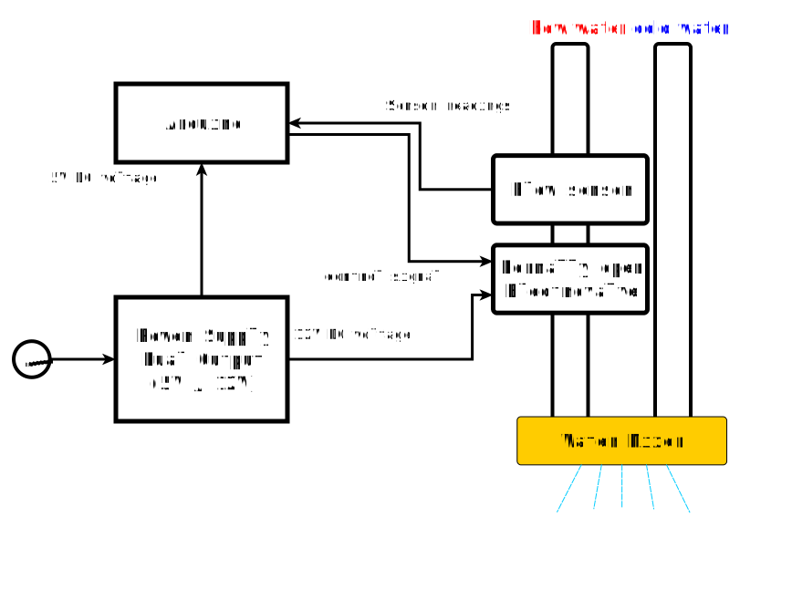
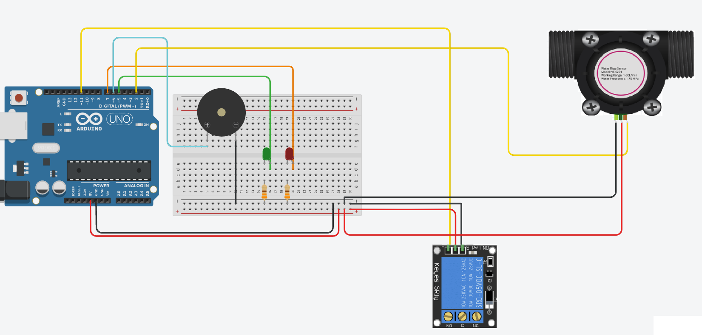
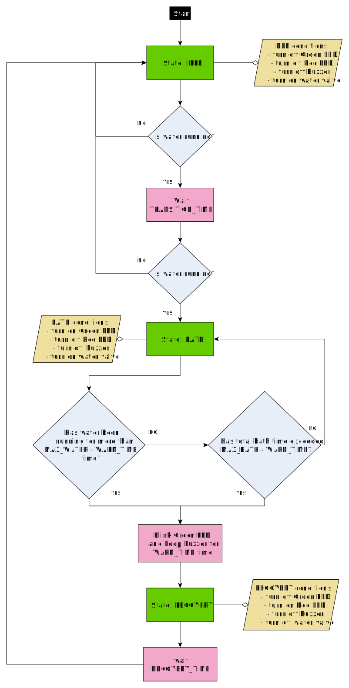
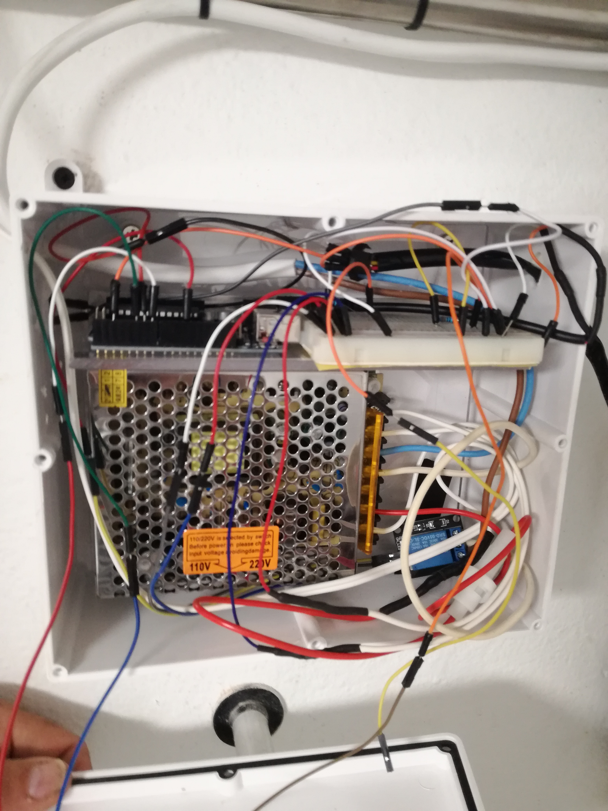
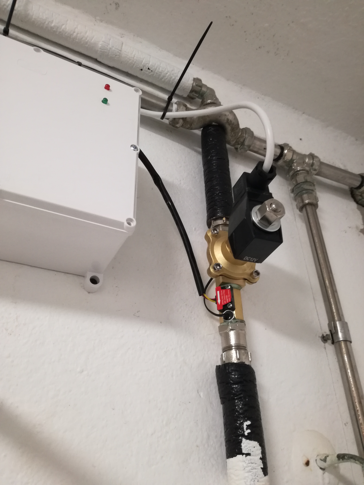

# Arduino Smart Shower Management System 

  

The Smart Shower Management System is an Arduino control system designed for reducing water use and energy costs during showers. It turns off the hot water flow after a pre-set and configurable time. By limiting shower time, it ensures hot showers for everyone, while contributing for major water savings, depending on the current use. In the event of a power outage, both hot and cold water are able to flow, since the electrovalve should be a normally-open valve.

## 1 - Components

The components required for this project are the following (in parenthesis I state the models that I used in my implementation):

* Arduino (Arduino UNO)
* Breadboard and cables
* Relay: 1-channel low level trigger (TZT KY-019 5V)
* 2 LEDs (1 green, 1 red)
* 2 Resistors (with resistance $330\Omega$)
* Buzzer (TMB09A03 active buzzer)
* Hall-effect flow sensor (YF-B7 5VDC)
* Normally-open solenoid valve (12VDC)
* Dual Output Power Supply (5VDC and 12VDC)

Note that the flow sensor and the solenoid valve must match your pipe diameter. 

## 2 - Installation & Connections

The high-level installation of the Smart Shower is highlighted in the figure below:

More in particular, the Arduino connections the following:
- Flow Sensor is connected to digital input pin 2 (for external interrupt)
- Red LED is connected to digital output pin 7
- Green LED is connected to digital output pin 5
- Buzzer is connected to digital output pin 6
- Relay is connected to digital output pin 11

The scheme is depicted in the following figure

  

## 3 - Program Description

The Arduino code implements a state machine controller. By measuring the flow at every second and monitoring the time, it controls the transitions between states and allows for a smart shower with 2 exit conditions (described below)

The defined states are the following:

  * <b>State::IDLE</b>
      * Green LED off 
      * Red LED off
      * Buzzer off
      * Water valve opened (water is flowing)
  * <b>State::BATH</b>
      * Green LED on (at the end of the BATH state the led starts blinking) 
      * Red LED off
      * Buzzer off (at the end of the BATH state the buzzer starts beeping)
      * Water valve opened (water is flowing)
  * <b>State::RECOVERY</b>
      * Green LED off 
      * Red LED on
      * Buzzer off
      * Water valve closed (water is not flowing)

  

The following timing definitions are made:
  * <b>MAX_WATER_TIME</b> - maximum water time during one bath cycle (defined in seconds)
  * <b>MAX_BATH_LENGTH</b> - maximum bath time (defined in seconds)
  * <b>WARN_TIME</b> - time to warn end of bath (defined in seconds)
  * <b>RECOVERY_TIME</b> - total time of the recovery state (defined in minutes)
  * <b>TRANSITION_TIME</b> - time to transition from IDLE state to BATH state (in seconds)
  
Moreover, <b>FLOW_THRESHOLD</b> denotes flow-rate threshold to trigger transition from IDLE to BATH state. When the flow sensor readings are above <b>FLOW_THRESHOLD</b>, water is considered to be flowing. This threshold may be set to a certain positive number, in order to discard the processing of residual flow.

Note that all these definitions can be easily tuned and upgraded to the Arduino board. 

### 3.1 - Program Flow

The program starts in IDLE state and measures the flow rate with a frequency of 1Hz. If the flow at a given time is greater than <b>FLOW_THRESHOLD</b>, then it activates a transition flag. If after <b>TRANSITION_TIME</b> time, the flow is still greater than the threshold, then the program transitions to BATH state, otherwise it keeps in IDLE state. This is to prevent triggering a bath cycle for short periods of water use (which may be related to cleaning purposes, for example).

When the program reaches the BATH state, it may transition to the RECOVERY state when one of two conditions is satisfied:
  * The total bath time exceeds <b>MAX_BATH_LENGTH</b>
  * The total time that the flow sensor is measuring positive readings above the thresold (hot-water running) exceeds <b>MAX_WATER_TIME</b>

Note that to get the total period of hot-water availability for a single shower, you also need to take into account the transition time from IDLE to BATH (specified by the <b>TRANSITION_TIME</b> constant).  

In any case, when the bath time is ending, the user is warned. During the last <b>WARN_TIME</b> seconds in the BATH state, the buzzer starts beeping and the green LED starts blinking.

### 3.2 - Flowchart

The program flow described above can be summarized in the following flowchart: 

  

## 4 - User Configurations

The parameters described above can be easily configured in [main.ino](./main/main.ino). All the tunable parameters can be found inside the `USER DEFINITIONS` section placed at the beginning of the file.

After making the intended changes, the program needs to be re-uploaded to the Arduino board.

## 5 - My implementation

Here you can see some photos of my implementation.

I put the Arduino, the breadboard, the power supply and all the wires inside a protection box. I made 2 small holes in the box to place the LEDs and another one to place the buzzer. The solenoid valve and the flow sensor are then placed in hot-water pipe system, as shown in the bottom figure. 

## 6 - Contacts

If you have any questions, doubts, or need further assistance regarding this Arduino project, feel free to contact me:

Rodrigo Oliveira
  - Email: <a href="mailto:rodrigo.moroliveira97@gmail.com">rodrigo.moroliveira97@gmail.com</a>
  - GitHub: [https://github.com/rodrigo-moliveira]
  - LinkedIn [https://www.linkedin.com/in/rodrigo-moroliveira/]

Please keep in mind that while I strive to provide support and assistance, I may not be able to respond immediately. Kindly allow for a reasonable amount of time for me to address your inquiries.

Your feedback and suggestions for improving this Arduino project are also welcomed. If you encounter any issues or discover bugs, please consider opening an issue on the project's GitHub repository so that it can be tracked and addressed effectively.

Thank you for your interest in this project, and I appreciate your understanding and cooperation in following the recommended communication channels outlined above.
